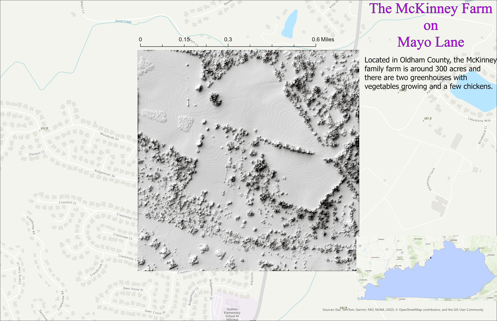

# Mayo-Lane-Farm
## This farm is located in Oldham County Ky and is owned by Joyce McKinney and runs in the McKinney family.

This farm has been in my family for generations and was here before all of the neighborhoods were built. There are many creeks that flow throughout our property and even a waterfall in the summer. There are many vegetables than are grown on this farm and cows are raised as well.

     
*McKinney Farm on Mayo Lane*

[Link to high-resolution version](mayo_lane1.pdf)     

This is my family farm on my dad's side and is located in oldham county Kentucky and covers 300 acres. I used kyfromabove data for this project. This is by Kelsey McKinney in GEO 409 at the University of Kentucky.
